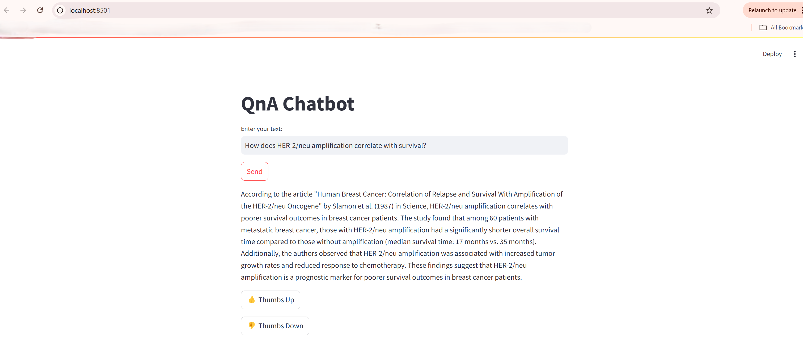

# QnA Chatbot
A QnA chatbot using a <b>Retrieval-Augmented Generation (RAG)</b> approach. 

### Architecture

image source: https://medium.com/@drjulija/what-is-retrieval-augmented-generation-rag-938e4f6e03d1

#### The archiutecture design is divided into two parts:
1. <b>Data Ingestion pipeline:T</b> It retrieves the document, creates chunks, generates the embeddings and store it into vectorstore.
2. <b>Data Retrieval & Generation:T</b> It takes the user query as input and creates the embeddings. Using semantic search, get the top 3 chunks from vectorstore and generates the response using LLM and sends back the response. The prompt to LLM is generated using system prompt, context and a question. The RAG pipeline is encompassed into Rest API and integreated into QnA chatbot UI for question and answering.

#### Additional Design consideration:
1. Feedback loop (User Interaction) such as thumbs-up and thumbs-down are stored into persistent storage to evaluate customer satisfaction store.
2. The response from the API is streamed, meaning the user doesn't have to wait for the entire response to be generated. Instead, the UI displays the response as it is being streamed, improving the overall user experience.
3. <b> MOST IMPORTANT</b>: The entire project was developed and tested on CPU with 16GB RAM. Adding GPU can improve the faster response time.

### Evaluation Framework:
- Extensive and automated Evaluation framework is implemented to generate the summary report of online metrics and csv file to store offline metrics. Please note here, pre-defined ground truth are used to evaluate. 
- In future enhancement, the ground truth can be stored in database and update as necessary.This script can be integrated into company's CI-CD pipeline to compare with benchmark.
- Online Metrics:
    - <b>Customer Satisfaction Score</b>: total  no. of thumbs-up / total interactions
    - <b>Accuracy</b>: (Total number of correct answers / total number of questions) * 100
    - <b>Average Response Time</b>: (Sum of response time of all input questions / total number of questions) * 100
- Offline Metrics: 
    - <b>Rouge, Bleu, RAGA scores</b> using pre-defined ground truth. This scores are stored per QnA along with questions, actual response, generated response in csv to further evaluation.
    - <b>Response Time</b>: Stores the time taken to generate the response of an user query


### Technology Stack:
- <b>Programming Language:T</b> Python (Python 3.12)
- <b>Embedding Model:T</b> sentence-transformers/all-MiniLM-l6-v2 from Hugging Face
- <b>Open-source LLM Model for response generation:T</b> Llama 2 7b chat model from Hugging Face
- <b>Rest API:T</b> FastAPI
- <b>Vector store:T</b> FAISS vector store
- <b>Front-end framework:T</b> Streamlit
- <b>Database:T</b> SQLite 3
- <b>IDE:</b> MS VS Code
- <b>Version Control:</b> Github
- <b>Hardware:<b> Windows 11 OS, 16GB RAM, intel i7 - 14 cores processor

### Reproducability
- <u>Prerequisites:</u> Before starting, ensure you have Python 3.8+, pip installed

1. Clone the Repository
```bash
git clone https://github.com/shahpriyankaj/qna-chatbot.git
cd qa-chatbot
```
2. Create a Virtual Environment
```bash
python3 -m venv venv
venv\Scripts\activate #On Unix, source venv/bin/activate
```
3. Install Dependencies
```bash
pip install -r requirements.txt
'''
To download the LLM Model, perform the following steps and copy the model to /model directory OR from https://huggingface.co/TheBloke/Llama-2-7B-Chat-GGUF/blob/main/llama-2-7b-chat.Q4_K_M.gguf -> download the model to /model directory
'''
pip3 install huggingface-hub>=0.17.1
huggingface-cli download TheBloke/Llama-2-7B-Chat-GGUF llama-2-7b-chat.Q4_K_M.gguf --local-dir . --local-dir-use-symlinks False
```
The llama-cpp-python package is used in RAG implementation. In case, you face any issue with llama-cpp-python package while running the scripts, Try following:
- running set CMAKE_ARGS=-DLLAMA_AVX2=ON
- try following commands on cmd
```bash
pip install --upgrade pip setuptools wheel
pip install --upgrade scikit-build-core cmake ninja
pip install --no-cache-dir llama-cpp-python
```
- Installing llama-cpp-python==0.2.28 works without any issue. And this package is already present in the requirements.txt file.

4. Read documents, create Embeddings and store in vectorstore
```bash
python data_ingestion.py
```
5. Run the FastAPI Backend

To start the FastAPI server:
```bash
uvicorn main:app --reload
```
This will run the backend at http://127.0.0.1:8000. You can test the API on Swagger UI at http://127.0.0.1:8000/docs

6. Run the Streamlit Frontend
```bash
streamlit run app.py
```
This will open the frontend interface at http://localhost:8501.

7. Run Evaluation (Optional)
To run the evaluation scripts:
```bash
python evaluation.py
```


### Project Structure
- <b>data/:</b> Directory to store the raw documents. Generally in a company, the documents are retrieved using API or stored in knowledge base.
- <b>data_pipeline/:</b> Document ingestion pipeline to store the embeddings into faiss vector store. Generally, in a company, there are multiple types of documents such as ppt, txt, web pages, pdf, json, doc, excel, etc. There are different langchain loaders to support and load various documents types. 
- <b>data_ingestion.py</b>: This is the script to run the data processing pipeline. In a company, generally the data processing to store the embeddings are scheduled as a job. 
- <b>app.py:</b> Streamlit frontend for interacting with the chatbot. Generally in a company, the UI is designed based on business requirements and company's UI/UX design patterns. This file also connects the SQLite to store the thumbs-up and thumbs-down interaction for a feedback loop.
- <b>main.py:</b> FastAPI backend providing the QnA API. Generally in a company, the API can have multiple features as well as error handling and it should return HTTP codes/error message during API failures. 
- <b>utils/:</b> Utility functions for creating embeddings
- <b>rag/:</b> RAG functions to retreive the documents from faiss vectorstore using semantic search, create embeddings of user query, create the prompt for LLM and generate response.
- <b>evaluation/:</b> Scripts for evaluating the chatbot's performance. The golden examples are stores in pandas df currently, but this can be further improved by adding into persistent storage. As well as, the automated evaluation script can be integrated into a company's CI-CD pipeline to compare with benchmark before the deployment. 
- <b>evaluation.py </b>: This script is just to run the testing and evaluation. Generally, in a company, this can be integrated into a company's CI-CD pipeline
- <b>model/:</b> It stores the faiss vectorstore as well as the LLM model
- <b>requirements.txt:</b> All the Python dependencies needed for the project.
- <b>qna_interactions.db:</b> It is a SQLite persistent db to store the thumbs-up/thumbs-down user interactions.
- <b>images/:</b> To store relavant images/video to explain the project


### Testing:
- <b>API Testing:</b>

- <b>UI Testing:</b>

- <b>Streaming response showns in UI/Demo
[Watch the video](images/Streaming_response_generation.mp4)

If you can't view the video, download it from images/ folder.
- <b>Using testing_and_evaluation file:</b> The testing can be done using pre-defined questions present in evaluation.testing_and_evaluation file. Call load_golden_examples() from this file to load 10 question and answer. 

### Assumption and future enhancements
- Since the lack of GPU, the chatbot is running extremely slow on CPU with 16GB RAM. Hence, it has high latency. This can be improved by adding GPU for faster processing. The embedding and chat models' configurations must change in the codebase to run on GPU, currently GPU config is disabled.
- The chatbot will only handle one request at a time. Multiple API requests will throw an error. This can be handled by hosting the application on kubernetes for ehanced scalability and throughput.
- No error handling & input validation is implemented in the prototype. The logging module can be added to log the errors. Additionally, the API should be able to return HTTP error codes in case of failure and log appropriate exception.
- The open source sentence-transformers/all-MiniLM-l6-v2 and Llama 2 7b chat models from Hugging Face are used in the project as both have better performance in terms of creating embedding as well generating response for chatbot
- The FAISS vectorstore was chosen due to Efficient similarity search, GPU support and scalability. This can be replaced by other vector database to store embeddings, its metadata, etc. The metadata will be helpful to show the chunks used to generate the response by LLM in the UI to improve intepretability, truthfulness and user trust.
- SQLite3 was chosen to store the user interaction/feedback/conversation history, etc. This can be replaced by other database based on company's techstack.
- Preprocessing of documents, chunking strategy, similarity search and (re)ranking of documents, prompts as well as adding other relevant evaluation metrics can be done in future for further improvements.

## Research Review
Link: https://github.com/mims-harvard/Clinical-knowledge-embeddings

The study presents embeddings trained on structured and unstructured medical data, improving clinical NLP tasks.

#### Takeaways from the Research:
- Clinical Knowledge Embeddings: A method for embedding clinical knowledge into machine learning models to enhance their performance in understanding and processing medical text. Embedding models combined with knowledge graphs (e.g., UMLS) lead to better reasoning and contextual relevance.
- Transfer Learning: The paper highlights how transfer learning can be applied to clinical NLP models, which could be valuable in personalized medicine.
- Model Interpretability: It stresses the importance of model interpretability in clinical settings to build trust and ensure transparency in AI systems.The embeddings allow for better medical document retrieval and can be used in explainable AI applications.

#### How This Research Can Benefit Humana
- Improved Medical Q/A Systems: Humana can enhance customer support chatbots by integrating clinical embeddings for better disease and treatment-related responses.
- Improved Healthcare Decision-Making: Embedding clinical knowledge could improve Humana’s ability to process and interpret healthcare-related data, leading to better healthcare recommendations and decision-making.
- Fraud Detection in Insurance Claims: By analyzing clinical language patterns, Humana can detect inconsistencies in claims and reduce fraud.
- Personalized Healthcare Recommendations: The embeddings help tailor responses based on patient history and insurance coverage.

#### How to Integrate This Research into the Q/A Chatbot
- Use Pretrained Clinical Embeddings: Convert medical-related text from the publication into clinical embeddings to improve retrieval quality.
- Incorporate Knowledge Graphs for Better Answers: 
Link responses to medical ontologies (e.g., UMLS, SNOMED CT) for verifiable explanations.
- Fine-tune LLM with Clinical Data: 
The research can be incorporated into the chatbot by integrating clinical knowledge embeddings for handling medical or healthcare-related questions. For instance, fine-tuning the chatbot with domain-specific embeddings can improve its understanding and accuracy in the healthcare context.

    Practical Example: Add specialized modules or models trained on medical datasets to handle questions about medical publications, diagnoses, and treatments.


